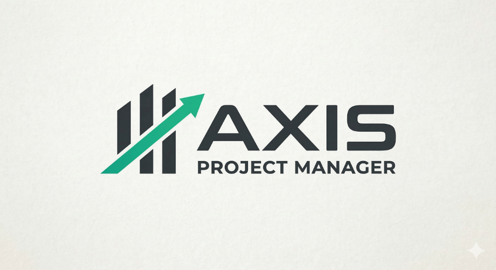

# Projeto AXIS - Gerenciamento de Equipes

  

Sistema de CRUD desenvolvido em Java para a gestão de equipes e usuários. O foco do projeto foi aplicar os conceitos de Orientação a Objetos e a arquitetura MVC (Model-View-Controller) em uma aplicação integrada a um banco de dados relacional.

---

## Estrutura do Projeto (MVC)

O código foi dividido em camadas para garantir uma melhor organização:

- **Model (`src/backend/model/`)**: Classes que representam as entidades do sistema (objetos de dados).
- **View**:
  - Para validação via terminal: `src/backend/test/select.java`.
  - Protótipo de telas: pasta `frontend/`.
- **Controller (`src/backend/controller/`)**: Faz o meio de campo entre a interface e os dados.
- **Repository / Database**: Onde fica a lógica de persistência e a classe de conexão JDBC.
- **Lib (`src/backend/lib/`)**: Onde está o driver `mysql-connector-j.jar`.

---

## Requisitos

Para rodar o projeto você vai precisar de:

1. **Java JDK 17** ou superior.
2. **XAMPP** ou um servidor MySQL rodando na porta 3306.
3. Banco de dados chamado `axis`.

---

## Guia do Desenvolvedor

Para facilitar a correção e o teste do projeto, separamos as instruções em dois guias rápidos:

1. 🔌 [**Como conectar o Banco de Dados**](src/backend/como_conectar_o_db.md)
2. 🏃 [**Como rodar o projeto**](src/backend/como_rodar.md)

---

## Desenvolvedores

- Victor Rego Muniz
- Gabriel Lourenço Datilo
- Talisia Vitória Santos Matos Maia
